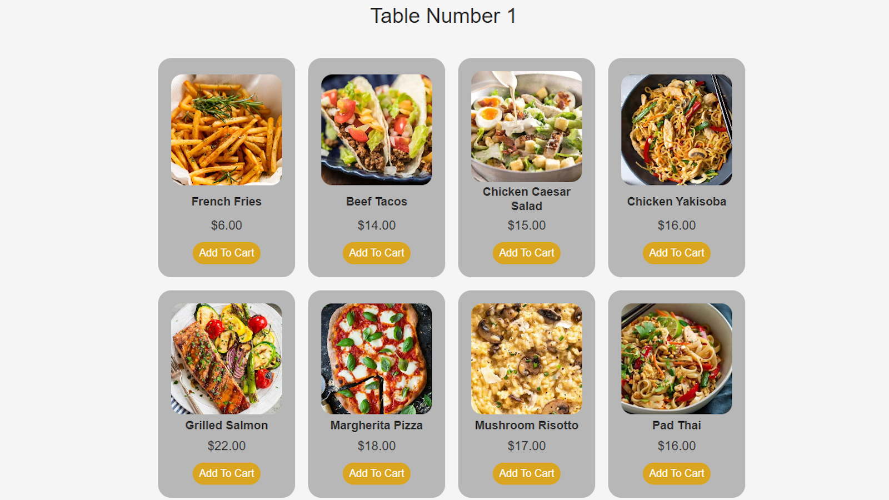

# Restaurant Ordering System

A web-based restaurant POS system with Django backend, supporting order processing in real-time and receipt printing.



## ⚠️ Project Status

This project was a group effort, and I did not contribute to every part of the system. My main contributions were focused on the backend, database design, and receipt printing system. 

**For demonstration purposes, parts of the project have been modified to run locally. Some original cloud integrations and production-level features have been simplified or removed, and replaced with local equivalents where necessary.**

## Overview

This repo contains a web-based restaurant POS system that allows customers to browse a digital menu, add items into a cart, and place orders directly from their device.

The backend is responsible for validating and storing the orders, which can then be further processed in real time, including optional receipt printing through a connected POS printer.

## Tech

This project demonstrates:
* Databases (MongoDB / SQLite)
* JavaScript
* HTML / CSS
* Python (Djongo & Django)

## How It Works

* Users access the menu through a browser.
* Menu items from the database are displayed dynamically.
* Users add items to a cart, storing data in local storage.
* On checkout, a POST request is sent to the Django backend.
* The backend validates and stores the order.
* Optionally, a background script can monitor orders and print receipts.

## How to Run

### Install Dependencies:
```bash
pip install -r requirements.txt
```

### Apply Migrations:
```bash
python manage.py makemigrations
python manage.py migrate
```

### Seed the Database:
```bash
python manage.py seed_menu
```

### Run the Server:
```bash
python manage.py runserver
```

### (Optional) Run the Receipt System:
```bash
python orderManagement\orderPrinter.py
```

## Highlights

### Database & Model Design
Designed database models to represent restaurant data and relationships.

```py
class FoodItem(models.Model):
    name = models.CharField(max_length=100)
    food_type = models.CharField(max_length=100)
    food_description = models.TextField(blank=True, null=True)
    food_price = models.DecimalField(max_digits=10, decimal_places=2)
    food_thumbnail = models.CharField(max_length=100)

    def __str__(self):
        return self.name


class Restaurant(models.Model):
    name = models.CharField(max_length=255)
    address = models.CharField(max_length=255)
    phone_number = models.CharField(max_length=20)
    website = models.URLField(blank=True, null=True)
    food_items = models.ManyToManyField(FoodItem)

    def __str__(self):
        return self.name


class Table(models.Model):
    table_number = models.IntegerField()
    table_status = models.BooleanField(default=False)
    restaurant = models.ForeignKey(Restaurant, related_name='tables', on_delete=models.CASCADE)

    class Meta:
        unique_together = ('table_number', 'restaurant')

    def __str__(self):
        return f"Table {self.table_number} - {self.restaurant.name}"
```

### Communication with Backend
Example order submission from the frontend.

```js
function sendOrderToDB(tableNumber) {
	const orderData = {
		table_number: tableNumber,
		restaurant_id: 1,
		items: carts
	};

	fetch('place_order', {
		method: 'POST',
		headers: {
			'Content-Type': 'application/json',
			'X-CSRFToken': getCSRFToken()
		},
		body: JSON.stringify(orderData)
	})
	.then(response => response.json())
	.then(data => {
		if (data.message) {
			alert('Payment successful! Order ID: ' + data.order_id);
			checkoutModal.style.display = 'none';
			clearItemsInCart();
		} else {
			alert('Error: ' + data.error);
		}
	})
	.catch(error => {
		alert('Failed to create order: ' + error.message);
	});
}
```

### Receipt Printing
Implemented a basic receipt printing system using raw ECS/POS instructions.

```py
hPrinter = win32print.OpenPrinter(PRINTER)
try:
	hJob = win32print.StartDocPrinter(hPrinter, 1, ("Receipt", None, "RAW"))
	win32print.StartPagePrinter(hPrinter)
	win32print.WritePrinter(hPrinter, formatted_text)
	win32print.WritePrinter(hPrinter, CUT_PAPER)
	win32print.EndPagePrinter(hPrinter)
	win32print.EndDocPrinter(hJob)
finally:
	win32print.ClosePrinter(hPrinter)
```

## What I Learned
* Handling communication between frontend and backend.
* Tradeoffs between MongoDB and relational databases like SQLite.
* Interfacing with external hardware such as a POS printer.
* Designing database structure in Django.

### What I Would Improve

If I were to remake this project today, I would:
* Replace Djongo with PostgreSQL or a more stable database integration.
* Containerize the project using Docker.
* Improve security and validation between frontend and backend when storing orders.